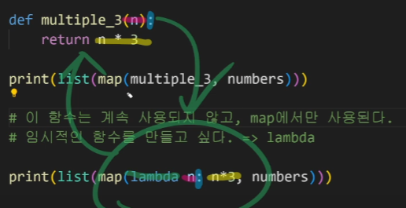
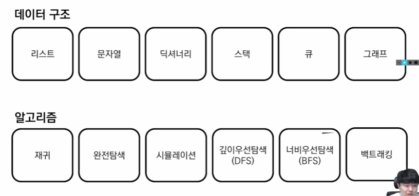
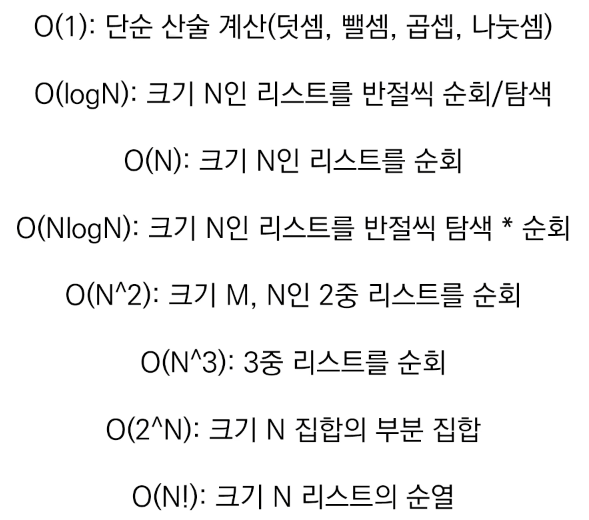
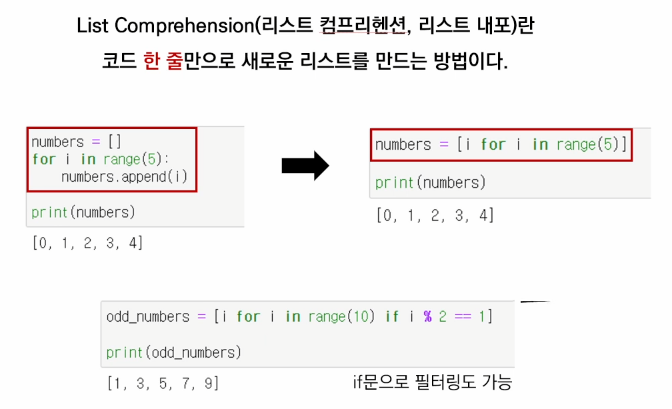
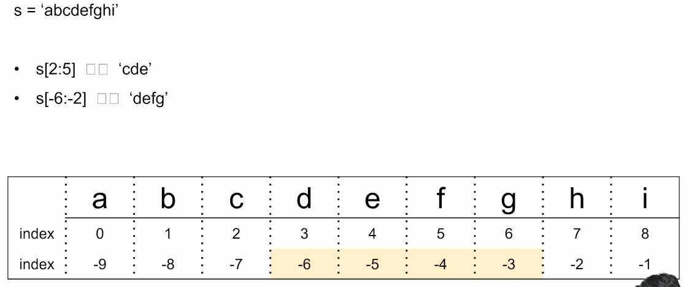
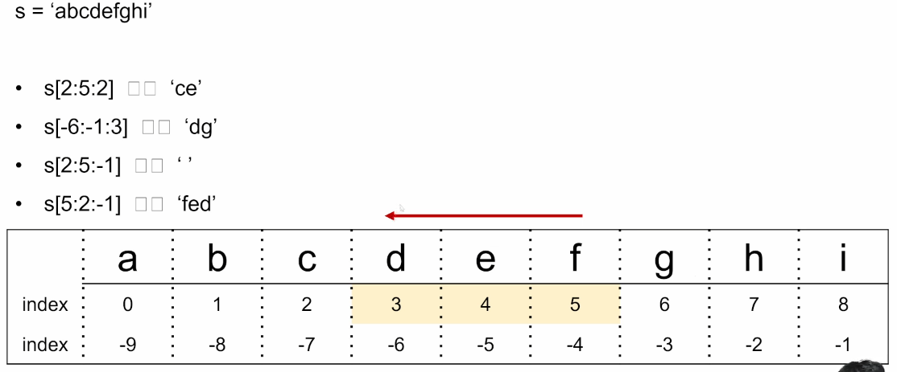
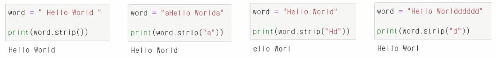
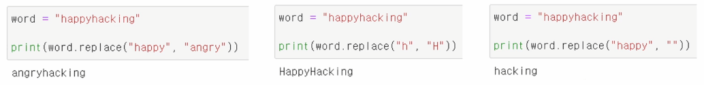
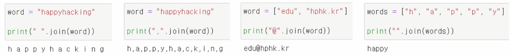

# TIL (Today I Learned)
# 절대 규칙
> 내 접근 방법 설명 - 코드 보고 구성요소가 이해가 가는지 (접근 방법을 아는데 구현 못하면 코드를 보자)

- 무슨 일이 있어도 하루 1commit
- 간단하게라도 꼭 정리하기

# 7/5 - Git의 시작

- 로컬저장소 만드는 단계
  - git init
  - git add
  - git status
  - git commit -m "커밋 메시지"
  - git log (--oneline , -2 --oneline)

# 7/6 - Github의 시작

- 원격저장소 만들기
  - Your repositories 에 들어가서 만든다.
- 로컬저장소에 원격저장소 등록
  - git remote add origin <원격저장소 주소>
    - 주소가 잘 들어갔는지 확인 명령어 : git remote -v
- 로컬저장소의 커밋을 원격저장소로 올리기
  - git push origin master
- git pull 과 git clone
  - 로컬저장소가 있을 때 pull / 통째로 받아와야 할 때 clone
  
# 7/7 - Git branch 그리고 협업

- branch 생성
  - git branch "branch name"
- branch 이동
  - git chechout "branch name"
    - 브랜치 생성과 동시에 이동 : git checkout -b "branch name"
- branch 목록 확인
  - git branch
- branch 이동해서 작업 후 marge
  - git checkout "blabla" --add commit--> git checkout master --> git marge blabla (꼭 원래의 HEAD에 와서 marge 할 것)
- branch 삭제
  - git branch -d "blabla" (다 쓴 branch는 제거해도 commit이 사라지지는 않음)
- branch conflict(브랜치 충돌)
  - 혼자 쭉 하는경우/다른 파일을 수정하는 경우 상관없음
  - 같은 파일을 수정하는 경우 conflict 일어남
    - 충돌 된 부분 수정 --> git add . --> git commit (code 보고 닫는다)

# 7/11 - Python 의 기초

> 컴퓨터`[Computer]`(Caulation(계산)+Remember(기억))
>
> 프로그래밍`[Programmng]`(명령어의 모음(집합))
>
> 언어 (컴퓨터에게 명령하는 말)

``````
선언적 지식(declarative knowledge) - 사실에 대한 내용
명령적 지식(imperative knowledge) - How-to
``````

- Python 의 특징
  - 동적 타이핑 언어 - 변수에 별도의 타입 지정이 필요 없음
  - **객체 지향 프로그래밍(Object Oriented Programming)**

> 코드는 위에서 아래로 / 오른쪽에서 왼쪽으로

- Python 문법 (숫자[정수 실수 복수] , 문자 , Bool[True False] , None)

  - 모든 결과는 ```print('hello')``` 를 해야 보여진다.

  - 변수(Variable)는 할당 연산자`=`를 동해 할당 된다.

  - `#` 는 컴퓨터는 못보는 메모, 주석

  - `0`은 False `1`은 True

  - 정수`int`  , 실수 `float` (소수점) , `str`문자열

  - `%`나머지 ,  `//`몫  ,  `**`거듭제곱

  - `<=`이하 , `>=`이상 , `==`같다 , `!=`같지않다

  - 인덱싱 첫 번째 자리는 `0`이다 , 거꾸로 하면 끝자리부터 `-1` `-2` `-3`(마지막 자리는 `-1`)

    ```python
    fruit = 'abcde'
    print(fruit[1:3])
    # bc
    
    fruit = 'abcde'
    print(fruit[-1])
    # e
    
    fruit = 'abcde'
    print(fruit[2:5:2])
    # ce
    
    fruit = 'abcde'
    print(fruit[3:1:-1])
    # dc
    
    fruit = 'abcde'
    print(fruit[:3])
    # abc # :(기본)부터 3자리
    
    fruit = 'abcde'
    print(fruit[1:])
    # bcde # 1부터 끝까지 
    
    [::] = 처음부터 끝까지 abcdef
    [::-1] = 뒤집기 fedcba
    
    'a' in 'apple'
    # True
    ```

  - `len`글자길이 , 

# 7/12

# 7/13 - 함수(def)

- 함수는 반드시 값을 하나만 return한다
  - return이 없는 경우에도 None을 반환한다
- return과 동시에 종료된다

# 7/14 - 문자열/리스트/

- 문자열

  - .split() --> 문자열 쪼개기
    - 문자열을 쪼개서 리스트로 반환
  - .join(['3', '5']) --> 문자열 붙이기
    - #35
  - 문자열 변경 .replace(old, new[,count])

  - 'apple'.find('p') # 1  , fine('k')시 -1 출력

- 리스트
  - .append('값')                   -
  - .extend(['appel', 'banana']) - 차례대로 맨 뒤에 추가하기 
    - 주의 .extend('apple') --> ['a','p','p','l','e'] 꼭 리스트 형식으로 넣기           
  - .insert(i, x) - i 위치에 x('apple')값을 추가                 
  - .remove('값')   
  - .sort() - 리스트 정렬
  - .count('값') - 리스트에서 항복 ''가 몇 개 존재하는지 **갯수**를 반환
  - .pop() - 리스트 가장 오른쪽에 있는 항목을 반환 후 제거                                                                                                                                                                                                                                                                                                                                                                                                                                                                                                                                                                                                                                                                                                                                                                                                                                                                                                                                                                                                                                                                                                                                                                                                                                                                                                                                                                                                                                                                                                                                                                                                                                                                                                                                                                                                                                                                                                                                                                                                                                                                                                                                                                                                                                 
  - .index('값') - '값'의 위치를 반환 #0,1,2,3,4,5  
    - .reverse() - 순서를 반대로 뒤집는다 (정렬 아님)

# 7/15 - 모듈

# 7/18  - 딕셔너리 마무리 & 디버깅 & 에러와 예외

``````python
# 딕셔너리 추가
result = {}
result['a'] = 0
print(result) # {'a':0}

word = 'banana'

result = {}

for char in word:
    print(char)
    # 키가 없으면 1으로 초기화를 하고
    if char not in result:
        result[char] = 1
    # 키가 있으면 기존 값에 더하자
    else:
        result[char] = result[char] + 1
# 츌력결과        
print(result)
# b
# a
# n
# a
# n
# a
{'b':1, 'a':3, 'n':2}        
``````

- **디버깅**(주석&출력 / VScode / 파이썬시뮬)
- 에러(Error)
  - 문법 에러(Syntax Error) - 표시된 line을 시점으로 띄어쓰기 따옴표 등등 확인
  - TypeError - 정수 실수 문자 등등
  - ValueError - 타입은 올바르나 값이 적절하지 않거나 없는 경우(코드가 잘못 됨)
  - IndexError - 목록보다 넘어서는 걸 출력하고자 했을 때
  - KeyError - 딕셔너리 활용과정 (키가 없어서)
  - ModuleNotFoundError - 존재하지 않는 모듈을 import 하는경우
  - IndentationError - 스페이스, 탭 등등
  - Keyboardinterrupt - 임의로 코드가 계속 돌 때 (Ctrl + c 로 종료)

# 7/19 - OOP(객체지향 프로그래밍)

> **객체(object)는 특정 타입(class)의 인스턴스(instance) 이다.**
>
> 123,900,5 는 int의 인스턴스
>
> 'hello','bye' 는 string의 인스턴스

- 객체 지향 프로그래밍

  - 사각형 - **클래스(class)** #사람
  - 각 사각형 (R1,R2) - **인스턴스(instance)** #아이유
  - 사각형의 정보 - **속성(attribute)**
    - 가로길이, 세로길이
  - 사각형의 행동/기능 - **메소드(method)**
    - 넓이를 구한다. 높이를 구한다.

- 기본 문법

  ```python
  # 클래스 정의
  class MyClass:
      pass
  # 인스턴스 생성 - 생성자 _ _init_ _ / 소멸자 _ _del_ _
  my_instance = MyClass()
  # 메서드 호출
  my_instance.my_method()
  # 속성
  my_instance.my_attribute
  
  # 변수이름짓기
  # 스네이크 케이스 - snake_case (웬만하면 스네이크 케이스 사용)
  # 카멜 케이스 - CamelCase
  
  # 예
  #list : 클래스
  #[] : 인스턴스
  #sort : 메소드
  ```
  

# 7/20 - OOP(객체지향 프로그래밍)

# 7/21 - 파이썬 응용&심화 / 모듈(패키지)

- 리스트 딕셔너리 컴프리핸션

  ```python
  # 리스트
  even_list = [i**2 for i in range(10) if i % 2 == 0]
  print(even+list)
  # [0, 2, 4, 6, 8]
  
  # 딕셔너리
  even_dict = {}
  for number in range(1, 4):
      even_dict[number] = number ** 3
  print(even_dict)
  # {number: number**3 for number in range(1, 4)}
       키      값
  ```

- 람다함수 lambda [parameter] : 표현식



- 파이썬 패키지 관리자(pip)

```pip list - 패키지 설치 확인 명령어
pip list - 패키지 설치 확인 명령어

pip uninstall requests - pip 삭제 명령어

which python - python이 설치된 곳 찾는 명령어 
```

# 7/22 - 프로젝트02 - API(Application Programming Interface)

- API 활용시 확인 사항
  - **요청하는 방식에 대한 이해**
    - 인증 방식
    - URL 생성
      - 기본 주소
      - 원하는 기능에 대한 추가 경로
      - 요청 변수 (필수와 선택)
  - **응답 결과에 대한 이해**
    - 응답 결과 타입 (JSON)
    - 응답 결과 구조

# 7/25 - 알고리즘

- 코딩테스트

  - 꾸준함
  - 문제 고민 쉬운 문제는 1시간 어려운 문제는 2시간은 고민해보기
  - 남의 풀이 보는 것 좋다, 단 다시 풀어서 내 것을 만들자
  - 코딩테스트를 편하게 통과하려면 350 문제 정도만 풀면 된다

- 프로그램 = 데이터구조 + 알고리즘

  

# 7/26 - 알고리즘 - 빅오(Big-O) 표기법



# 7/27 - 리스트컴프리헨션, 문자열(String), 아스키(ASCII)코드



- 문자열은 시퀀스형(순회가능한) 자료형이다

- 문자열 슬라이싱

  - 앞에서 갈 때는 0부터, 뒤에서 올 때는 -1부터 (- 쉽게 보기 전체길이 - 마이너스인덱스 )

  



***거꾸로 일 때는 방향도 바꿔줘야 한다 (4번 째 예)***

​		s[:3] - 시작부터 3까지(2까지)

​		s[5:] - 5부터 끝까지

​		s[:] - 싹 다 출력

​		s[::-1] - 거꾸로 싹 다 출력

- 양 끝 문자를 제거 할 때 (원본은 변하지 않는다)

  

- .find('문자') - 문자가 있으면 '1' 출력 없다면 '-1' 출력

- 기존 문자를 새로운 문자로 바꿀 때

  

- 특정 문자를 문자 사이에 삽입

  

- 아스키코드

# 7/28 - 딕셔너리(Dictionary)

```python
# 일반인
scores = [ 'A','B','C','D','A','A']
counter= {
    'A': 0,
    'B': 0,
    'C': 0,
    'D': 0,
}
for i in scores:
    counter[i] += 1
# print(counter) = {'A':3,'B':1'C':1,'D':1}


# 흑마법
scores = [ 'A','B','C','D','A','A']
easy_counter = Counter(scores)
# print(easy_counter) = Counter({'A:3,'B:1','C:1','D:1'})
```

# 8/1 - 스택(stack) / 큐(queue)

- 스택 - O(1) 상수 복잡도
  - 후입선출
- 큐 - O(n) 선형 복잡도 / 덱을 쓴다면 상수 복잡도로 사용 가능 양방향으로 넣고 빼고 가능
  - 선입선출
  - 왼쪽에서 넣고 빼고는 appendleft()/popleft() 오른쪽은 append() ***(기본은 append(값) -> popleft())***

# 8/2 - 힙(heapq) / 셋(set)

# 8/3 - 행렬

```python
matrix = [list(map(int, input().split())) for i in range(3)]

matrix = [list(map(int, input().split())) for i in range(8)] # 8 = n

# 문자나 문자열의 경우엔 split()을 하지 않아도 된다.
```

